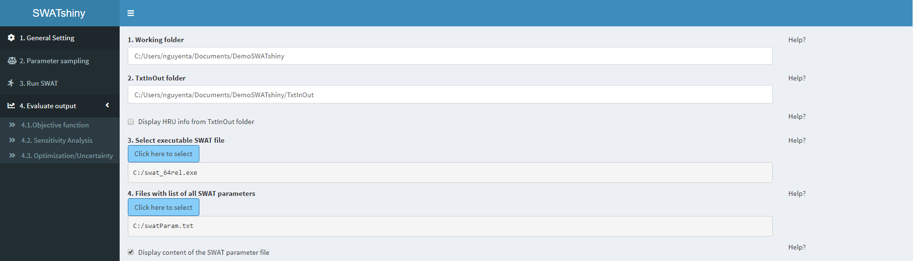
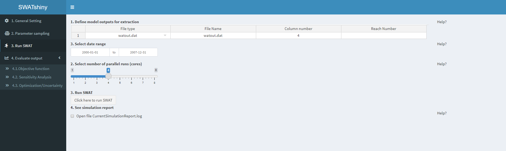
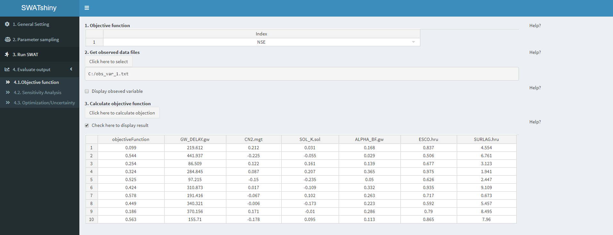
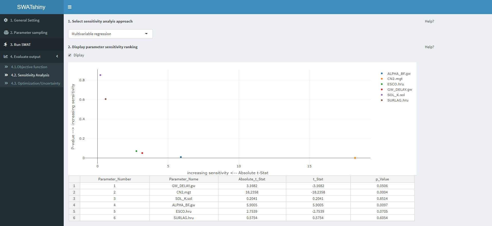
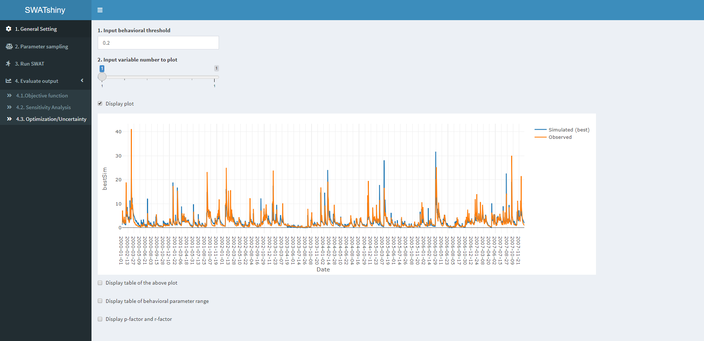

## SWATshiny

- This is an interactive web-based app for parallel parameter sensitivity, calibration, and uncertainty analysis with the Soil and Water Assessment Tool ([SWAT](https://swat.tamu.edu/)).
- The latest version of this app is always in the "master" branch.
- If you like to contribute to the code, have any suggestions, report errors, please contact [me](https://www.ufz.de/index.php?en=46415). The best way to contact me is via the  [google group](https://groups.google.com/g/swatshiny) specially designed for this app 
- This is the first version (v1.0), the app will be continued to be developed while trying to get comments/feedback from the user community

## Getting Started!

This app ([https://github.com/tamnva/SWATshiny](https://github.com/tamnva/SWATshiny)) is designed for complete beginner to advance R user, you can use this app even you don't know anything about R. Just install the latest version of R that you can find [here](https://cran.r-project.org/bin/windows/base/). I would also suggest installing [RStudio](https://www.rstudio.com/).  After installing R, open R (or RStudio) and use the following code to download the app to your local machine:

    # Install shiny package (skip the first line if you already have shiny installed)
    install.packages("shiny")
    library(shiny)
    
    # Download this SWATshiny app (code + data) to your local machine and run it
    runGitHub("SWATshiny", "tamnva")

If the app is successfully downloaded to your local machine. The following interface (attached screenshot on the end of this document) will appear and you can start using this app. Start with Tab '1. General setting' => '2. Parameter sampling' => and so on. On each tab there are subitems (e.g., in the first figure, start with '1. Working folder' => '2. TxtInOut folder' => and so on)

If you don't know which input is required, simply clicking to "Help?" at the right side of each respective input field. A sample of data for running this app can be downloaded from my [GitHub repository](https://github.com/tamnva/SWATshiny/tree/master/data), including:

 1. _\data\TxtInOut_: A TxtInOut folder and all associated files created by ArcSWAT
 2. _swatParam.txt_: An input file describing all SWAT parameters that you will need for the input field _1. General Setting => 4. Files with list of all SWAT Parameters_
 3. _obs_var_1.txt_: Observed data file (streamflow) at the catchment outlet that you might need to input to evaluate the model performance _4.1. Objective function => 2. Get observed data files_

## Screenshot of each step
### Step 1. General Setting

  

### Step 2. Parameter sampling

  

### Step 3. Run SWAT

  

### Step 4.1 Objective Function

  

### Step 4.2. Sensitivity Analysis

  

### Step 4.3. Optimization/Uncertainty Analysis

  

#### Plots and table are interactive. You can zoom the plot in or out, save the table and plot (right click to the table and plot to see all options)

