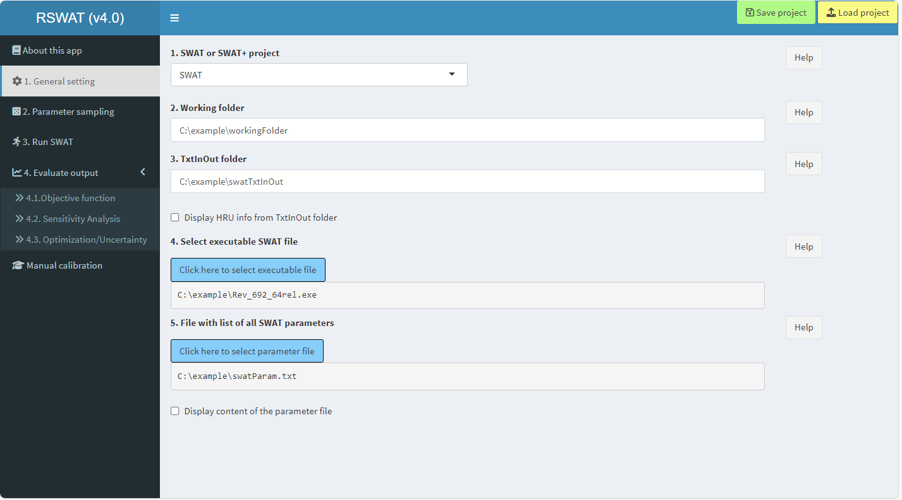
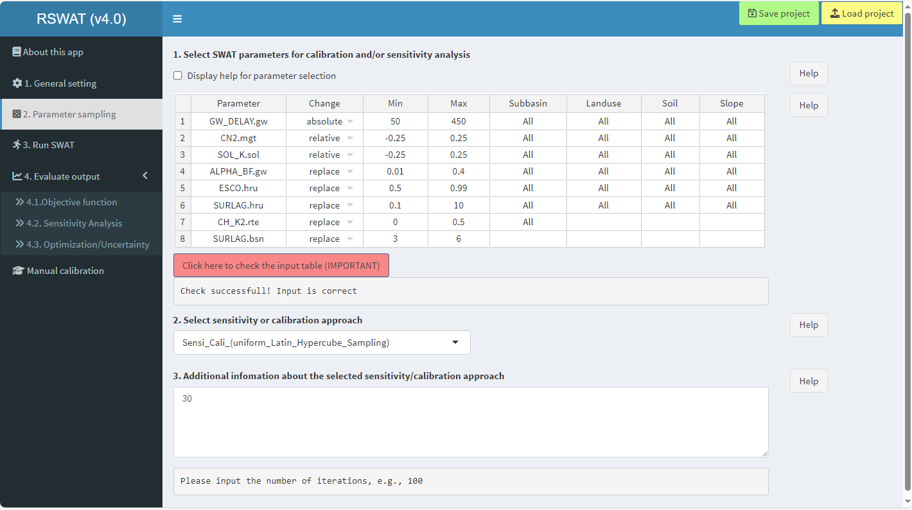
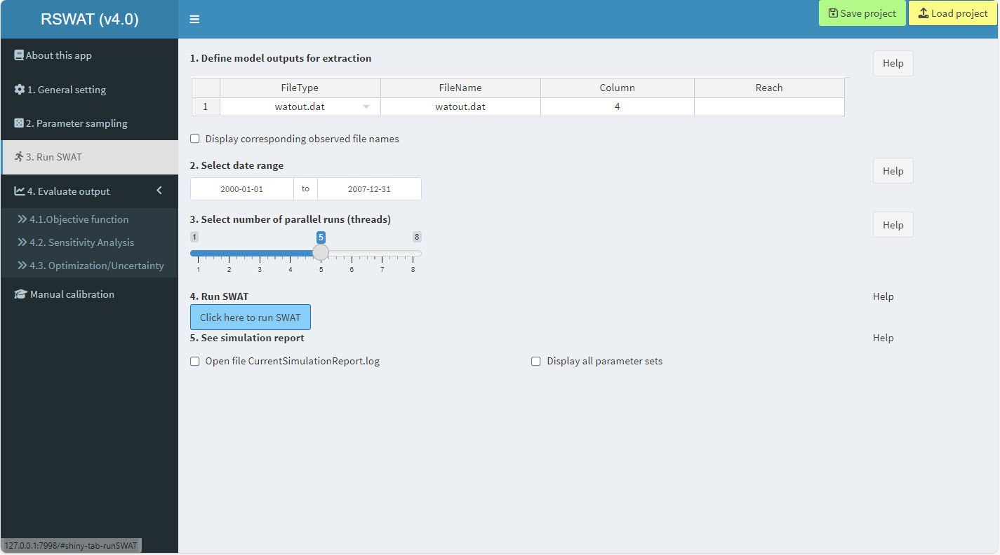
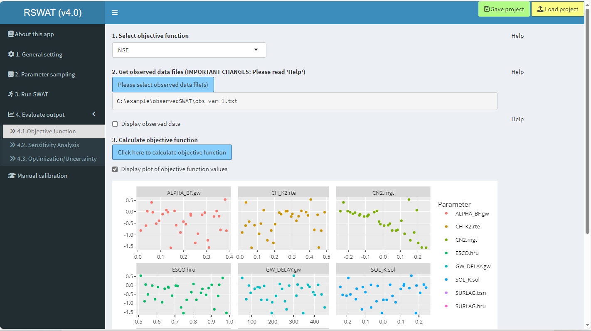
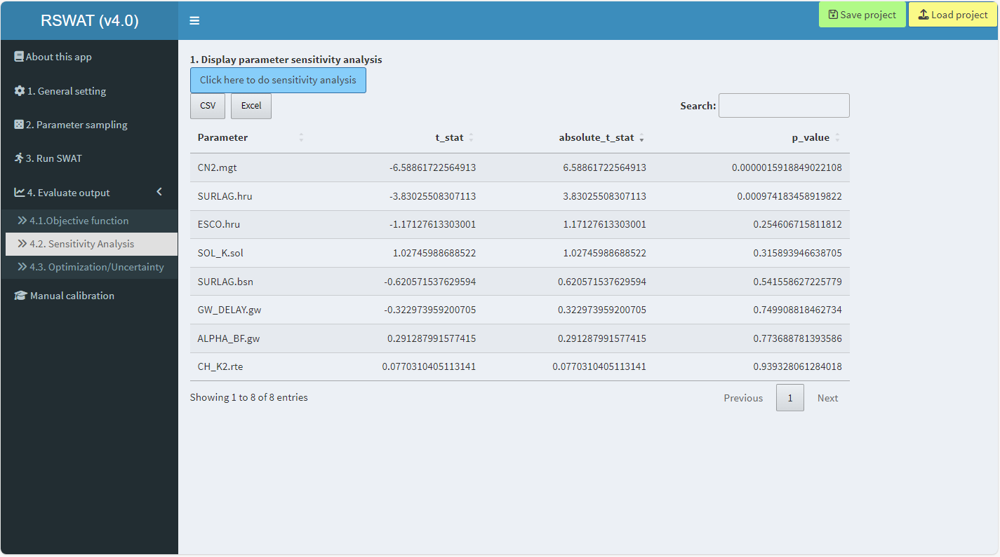
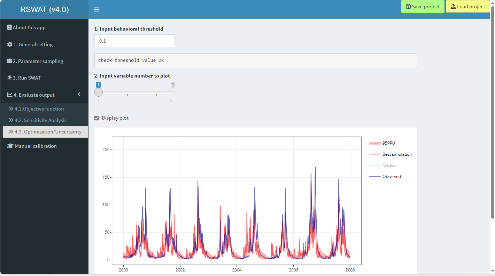

## RSWAT <a href="https://github.com/tamnva/R-SWAT/tree/master/inst/R-SWAT/figures/RSWAT_logo.svg"></a>

[](https://zenodo.org/badge/latestdoi/395115735) [](https://github.com/tamnva/R-SWAT/releases) [](https://github.com/tamnva/R-SWAT/actions/workflows/R-CMD-check.yaml) [](https://joss.theoj.org/papers/89a04bc6f9a2a2b08cbac33fcd91c0c6)

- This is an R package with a graphical user interface (GUI) for parallel parameter calibration, sensitivity, and uncertainty analyses with the Soil and Water Assessment Tool models (e.g., [SWAT](https://swat.tamu.edu/), [SWAT+](https://swat.tamu.edu/software/plus/), [SWAT-Carbon](https://sites.google.com/view/swat-carbon), and its other modified versions). 
- RSWAT can also be used without the GUI, please see the RSWAT vignettes.
- If you would like to contribute to the code, have any suggestions, or want to report errors, please contact me via the [Google group](https://groups.google.com/g/R-SWAT) or GitHub. Tutorial videos can be found on the [RSWAT YouTube channel](https://www.youtube.com/channel/UCRK1rKFiNgYbG7qKWxAPtEQ)
- RSWAT will be constantly developed to serve the SWAT community, together we can make this package much better.
- **IMPORTANT: The older version of this package, called the R-SWAT app, [can be found here](https://github.com/tamnva/R-SWAT/tree/4d49ac6a2e153a34081d7d7b24958af0127f4ed3).**

## Quick Start!

RSWAT is an R package hosted on GitHub (to be submitted to CRAN soon). First, you need to install [R](https://cloud.r-project.org/), and [RStudio](https://posit.co/download/rstudio-desktop/) (installing RStudio is recommended, not a MUST) then run the following commands **in RStudio**. If you run in R, package vignettes cannot be built, however, this DOES NOT affect the functionalities of RSWAT.

To run RSWAT, the SWAT/SWAT+ model is required.  The SWAT/SWAT+ model (executable file) could be obtained from the official [SWAT website](https://swat.tamu.edu/software/).

```R
# First install remotes package if you have not installed
install.packages("remotes")

# Then install RSWAT package (if you run with RStudio)
# IMPORTANT: if you run in R, please set "build_vignettes = FALSE"
remotes::install_github("tamnva/R-SWAT", force = TRUE, dependencies = TRUE, build_vignettes = TRUE)

# Load RSWAT
library(RSWAT)

# Extract example data (3.6 MB of storage). TODO: replace tempdir()
#     with your path, e.g., "C:/example"
# The example data DO NOT include the SWAT executable files
#    (please download them at https://swat.tamu.edu/software/)
extracExampleData(exampleData, "all", tempdir())

# Call RSWAT graphical user interface: DO NOT use RSWAT::showRSWAT()
showRSWAT()
```


The following interface (attached screenshot at the end of this document) will appear and you can start using this app. Start with Tab '1. General setting' => '2. Parameter sampling' => and so on. On each tab there are subitems (e.g., in the first figure, start with '1. Working folder' => '2. TxtInOut folder' => and so on).

If you don't know which input is required, simply click "Help?" on the right side of each respective input field. A sample of data for running this app can be downloaded from the [R-SWAT/data](https://github.com/tamnva/R-SWAT/tree/4d49ac6a2e153a34081d7d7b24958af0127f4ed3) or by typing the following command in R:

Data extracted from the above command are stored in the temporal directory (or your defined directory), which include:

| Data | Description |
| --- | ----------- |
| swatTxtInOut folder| TxtInOut folder with associated files of SWAT+ |
| swatParam.txt | Parameter file of SWAT |
| observedSWAT | Observed streamflow at the catchment outlet of SWAT |
| swatPlusTxtInOut | TxtInOut folder with associated files of SWAT+ |
| cal_parms.cal | Parameter file of SWAT+ |
| observedSWATPlus | Observed streamflow at the catchment outlet of SWAT+ |


# Quick demo (streamflow calibration with SWAT)

You need to run the aforementioned R script (in section Quick Start) to call the GUI of RSWAT. In the latest version, the GUI could be slightly difference with the one showing below

<p align="center">
  
</p>

<p align="center">
  
</p>

<p align="center">
  
</p>

<p align="center">
  
</p>

<p align="center">
  
</p>

<p align="center">
  
</p>


## Citing RSWAT

**Nguyen, T. V.**, Dietrich, J., Dang, D. T., Tran, D. A., Doan, B. V., Sarrazin, F. J., Abbaspour, K., Srinivasan, R. (2022). An interactive graphical interface tool for parameter calibration, sensitivity analysis, uncertainty analysis, and visualization for the Soil and Water Assessment Tool. Environmental Modelling & Software, 156, 105497. https://doi.org/10.1016/j.envsoft.2022.105497.
