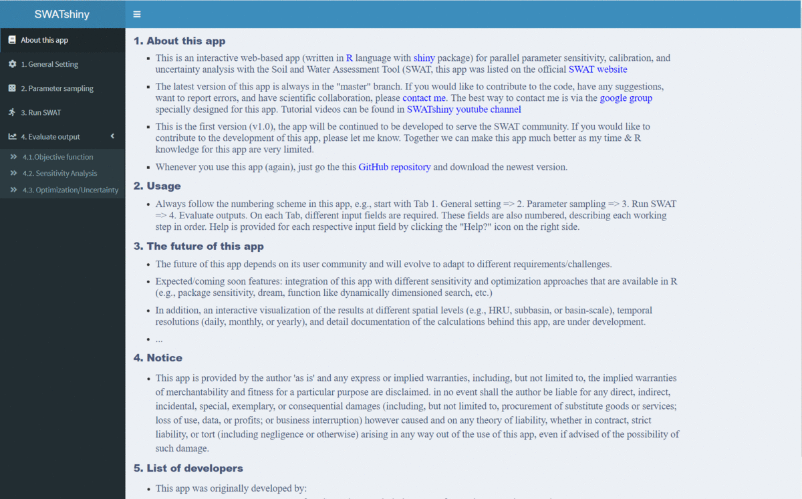

## R-SWAT

- This is an interactive web-based app (written in [R](https://cran.r-project.org/bin/windows/base/) language with [shiny](https://shiny.rstudio.com/) package) for parallel parameter sensitivity, calibration, and uncertainty analysis with the Soil and Water Assessment Tool ([SWAT](https://swat.tamu.edu/)).
- The latest version of this app is always in the "master" branch.
- If you would like to contribute to the code, have any suggestions, want to report errors, and have scientific collaboration, please contact [me](https://www.ufz.de/index.php?en=46415). The best way to contact me is via the  [google group](https://groups.google.com/g/swatshiny) specially designed for this app. Tutorial videos can be found in [R-SWAT youtube channel](https://www.youtube.com/channel/UCRK1rKFiNgYbG7qKWxAPtEQ)
- This is the first version, the app will be continued to be developed to serve the SWAT community. If you would like to contribute to the development of this app, please let me know. **Together we can make this app much better as my time and R knowledge for this app are very limited.
- This work has not been published in any journal. If you use this program for your publication, please contact me.

## Getting Started!

This app is designed for R beginner to advance users, you can use this app even you don't know anything about R. 

To run this app, install latest **[R version 4.1.1](https://cran.r-project.org/bin/windows/base/)** or newer version (If you use old version of R this **might NOT** work). Then **[install R studio](https://www.rstudio.com/)**. Then do the following steps:

- **Step 1**: [Click here](https://github.com/tamnva/SWATshiny/archive/refs/heads/master.zip) to download the whole code of this app.
- **Step 2**: Extract the downloaded file => Click to the file *SWATshiny.Rproj* to open the project.
- **Step 3**: Open the file *./R/loadPackages.R* with R studio and install all packages list in this file (take 5-10 minutes)
- **Step 4**: Open the file server.R or ui.R in R studio => then click the green button named *Run App*

**Next time** when you use this app just **step 4** is needed **or you can download the latest app and run it using the following commands**

    # Load shiny package
    library(shiny)
    
    # Automatically download this R-SWAT app (code + data) to your local machine and run it
    runGitHub("SWATshiny", "tamnva")
    
    # If you already manually downloaded it from the github, you can run the app using this command
    # runApp("RSWAT_folder")

The following interface (attached screenshot on the end of this document) will appear and you can start using this app. Start with Tab '1. General setting' => '2. Parameter sampling' => and so on. On each tab there are subitems (e.g., in the first figure, start with '1. Working folder' => '2. TxtInOut folder' => and so on)

If you don't know which input is required, simply clicking to "Help?" at the right side of each respective input field. A sample of data for running this app can be downloaded from my [GitHub repository](https://github.com/tamnva/SWATshiny/tree/master/data), including:

 1. _/data/TxtInOut_: A TxtInOut folder and all associated files created by ArcSWAT
 2. _swatParam.txt_: An input file describing all SWAT parameters that you will need for the input field _1. General Setting => 4. Files with list of all SWAT Parameters_
 3. _obs_var_1.txt_: Observed data file (streamflow) at the catchment outlet that you might need to input to evaluate the model performance _4.1. Objective function => 2. Get observed data files_
  4. _data/examples_: you will see examples how to include new parameters in new files (e.g., this could be the case  if you modify SWAT code)

## R-SWAT user interface

  

