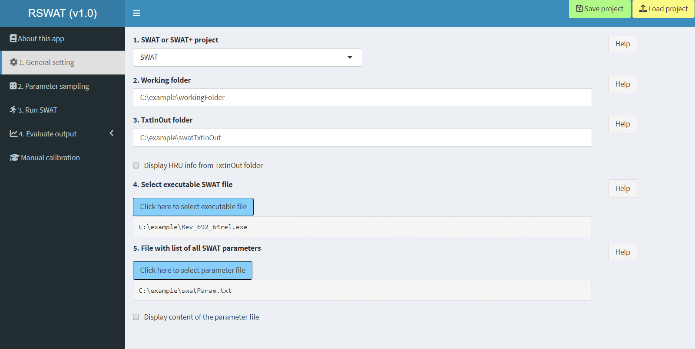

## RSWAT <a href="https://github.com/tamnva/R-SWAT/tree/master/inst/R-SWAT/figures/RSWAT_logo.svg"></a>

[](https://zenodo.org/badge/latestdoi/395115735) [](https://github.com/tamnva/R-SWAT/blob/master/LICENSE) [](https://github.com/tamnva/R-SWAT/releases) [](https://github.com/tamnva/R-SWAT/actions/workflows/R-CMD-check.yaml)

- This is an R package with a graphical user interface (GUI) for parallel parameter calibration, sensitivity, and uncertainty analyses with the Soil and Water Assessment Tool models (e.g., [SWAT](https://swat.tamu.edu/), [SWAT+](https://swat.tamu.edu/software/plus/), [SWAT-Carbon](https://sites.google.com/view/swat-carbon), and its other modified versions). 
- RSWAT can also be used without the GUI, please see the RSWAT vignettes (see Quick Start section).
- The latest version of this app is always in the [development](https://github.com/tamnva/R-SWAT/tree/development) branch.
- If you would like to contribute to the code, have any suggestions, want to report errors, or have scientific collaboration, please contact [me](https://www.ufz.de/index.php?en=46415). The best way to contact me is via the [Google group](https://groups.google.com/g/R-SWAT) specially designed for this app. Tutorial videos can be found on the [RSWAT YouTube channel](https://www.youtube.com/channel/UCRK1rKFiNgYbG7qKWxAPtEQ)
- RSWAT will be constantly developed to serve the SWAT community. Please feel free to contribute to this package, together we can make this package much better.
- **IMPORTANT: The older version of this package, called the R-SWAT app, [can be found here](https://github.com/tamnva/R-SWAT/tree/4d49ac6a2e153a34081d7d7b24958af0127f4ed3).**

## Quick Start!

RSWAT is an R package hosted on GitHub (to be submitted to CRAN soon). First, you need to install [R](https://cloud.r-project.org/), and  [RStudio](https://posit.co/download/rstudio-desktop/), then **run** the following commands **in RStudio** (if you run in R, package vignettes cannot be built).

```R
# First install remotes package if you have not installed
install.packages("remotes")

# Then install RSWAT package 
remotes::install_github("tamnva/R-SWAT", force = TRUE, dependencies = TRUE, build_vignettes = TRUE)

# Call RSWAT graphical user interface: DO NOT use RSWAT:showRSWAT()
library(RSWAT) 
showRSWAT()
```

The following interface (attached screenshot at the end of this document) will appear and you can start using this app. Start with Tab '1. General setting' => '2. Parameter sampling' => and so on. On each tab there are subitems (e.g., in the first figure, start with '1. Working folder' => '2. TxtInOut folder' => and so on)

If you don't know which input is required, simply click "Help?" on the right side of each respective input field. A sample of data for running this app can be downloaded from the [R-SWAT/data](https://github.com/tamnva/R-SWAT/tree/4d49ac6a2e153a34081d7d7b24958af0127f4ed3) or by typing the following command in R:

```R
# Command to extract all example dataset (3.6 MB of storage)
# Example: extracExampleData(exampleData, "all", "C:/example")

extracExampleData(exampleData, "all", "replace_with_your_path")
```

Data extracted from the above command are stored in this path "replace_with_your_desired_path" which include:

| Data | Description |
| --- | ----------- |
| swatTxtInOut folder| TxtInOut folder with associated files of SWAT+ |
| swatParam.txt | Parameter file of SWAT |
| observedSWAT | Observed streamflow at the catchment outlet of SWAT |
| swatPlusTxtInOut | TxtInOut folder with associated files of SWAT+ |
| cal_parms.cal | Parameter file of SWAT+ |
| observedSWATPlus | Observed streamflow at the catchment outlet of SWAT+ |

Example of working without the user interface, please see the RSWAT vignettes:

```R
vignette("SUFI2_without_GUI",package="RSWAT")
```


## Citing RSWAT

**Nguyen, T. V.**, Dietrich, J., Dang, D. T., Tran, D. A., Doan, B. V., Sarrazin, F. J., Abbaspour, K., Srinivasan, R. (2022). An interactive graphical interface tool for parameter calibration, sensitivity analysis, uncertainty analysis, and visualization for the Soil and Water Assessment Tool. Environmental Modelling & Software, 156, 105497. https://doi.org/10.1016/j.envsoft.2022.105497.

**Nguyen, T. V.** (2024). RSWAT: An R package for the Soil and Water Assessment Tool models. Submitted to The Journal of Open Source Software.

# GUI of RSWAT


(NOTE: in the latest version, the user interface could be slightly difference)
<p align="center">
  
</p>
